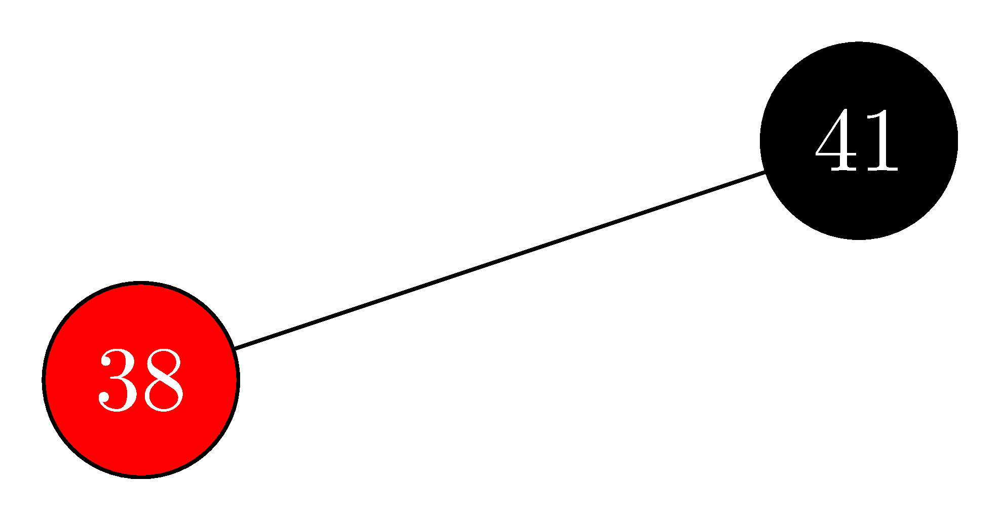

## 13.3-1

> In line 16 of $\text{RB-INSERT}$, we set the color of the newly inserted node $z$ to red. Observe that if we had chosen to set $z$'s color to black, then property 4 of a red-black tree would not be violated. Why didn't we choose to set $z$'s color to black?

If we chose to set the color of $z$ to black then we would be violating property 5 of being a red-black tree. Because any path from the root to a leaf under $z$ would have one more black node than the paths to the other leaves.

## 13.3-2

> Show the red-black trees that result after successively inserting the keys $41, 38, 31, 12, 19, 8$ into an initially empty red-black tree.

- insert $41$:

    

- insert $38$:

    

- insert $31$:

    

- insert $12$:

    

- insert $19$:

    

- insert $8$:

    

## 13.3-3

> Suppose that the black-height of each of the subtrees $\alpha, \beta, \gamma, \delta, \epsilon$ in Figures 13.5 and 13.6 is $k$. Label each node in each figure with its black-height to verify that the indicated transformation preserves property 5.

(Removed)

## 13.3-4

> Professor Teach is concerned that $\text{RB-INSERT-FIXUP}$ might set $T.nil.color$ to $\text{RED}$, in which case the test in line 1 would not cause the loop to terminate when $z$ is the root. Show that the professor's concern is unfounded by arguing that $\text{RB-INSERT-FIXUP}$ never sets $T.nil.color$ to $\text{RED}$.

(Removed)

## 13.3-5

> Consider a red-black tree formed by inserting $n$ nodes with $\text{RB-INSERT}$. Argue that if $n > 1$, the tree has at least one red node.

- **Case 1:** $z$ and $z.p.p$ are $\text{RED}$, if the loop terminates, then $z$ could not be the root, thus $z$ is $\text{RED}$ after the fix up.
- **Case 2:** $z$ and $z.p$ are $\text{RED}$, and after the rotation $z.p$ could not be the root, thus $z.p$ is $\text{RED}$ after the fix up.
- **Case 3:** $z$ is $\text{RED}$ and $z$ could not be the root, thus $z$ is $\text{RED}$ after the fix up.

Therefore, there is always at least one red node.

## 13.3-6

> Suggest how to implement $\text{RB-INSERT}$ efficiently if the representation for red-black trees includes no storage for parent pointers.

Use stack to record the path to the inserted node, then parent is the top element in the stack.

- **Case 1:** we pop $z.p$ and $z.p.p$.
- **Case 2:** we pop $z.p$ and $z.p.p$, then push $z.p.p$ and $z$.
- **Case 3:** we pop $z.p$, $z.p.p$ and $z.p.p.p$, then push $z.p$.
